# Dromcondra Craftshop - Online Store

* Supporting your local artisans.


## Project Goals

* The goal of this project is to create a digital counterpart for a successful local craft business in order for them to broaden their horizons and sell products to a wider audience. 

<a></a>

## Table of Contents <a name="contents"></a>

---

* [UX](#ux)
  * [User Goals](#user-goals)
  * [User Stories](#user-stories)
  * [Site Owner Goals](#site-owner-goals)
  * [User Requirements and Expectations](#user-requirements)
  * [Design Choices](#design-choices)
    * [Fonts](#fonts)
    * [Icons](#icons)
    * [Colors](#colors)
    * [Structure](#structure)
* [Wireframes and Flowcharts](#wireframes-and-flowcharts)
  * [Wireframes](#wireframes)
  * [Flowcharts](#flowcharts)
  * [Database Structure](#database-structure)
* [Technologies](#technologies)
  * [Languages](#languages)
  * [Libraries and Frameworks](#libraries-frameworks)
  * [Tools](#tools)
* [Features](#features)
  * [Features that have been developed](#features-done)
  * [Features that will be implemented in the future](#features-future)
* [Testing](#testing)
* [Bugs](#bugs)
* [Deployment](#deployment)
  * [Local Deployment](#local-deployment)
  * [Heroku/AWS Deployment](#remote-deployment)
* [Credit](#credit)

## UX (User Experience) <a name="ux"></a>

---

### User Goals <a name="user-goals"></a>

* As a **site owner**, I want a functional e-business platform to complement my real-world business.
* As a **shopper**, I want to be able to view and buy this company's products on-line.
* As a ....

### User Stories <a name="user-stories"></a>

#### Viewing and Navigation 

* As a **Shopper**, I want to be able to **view the site's products** so that I can **chose some to buy**.
* As a **Shopper**, I want to be able to **view an individual product's detailed information** so that I can **see the detailed description, manufacturer or creator, price and rating.**.
* As a **Shopper**, I want to be able to **see the number of items and value of my shopping basket** so that I can **be aware of how much I've committed to spend**.

#### Registration and User Accounts

* As a **Site User**, I want to be able to **easily sign up for an account** so that I can **have an account and view my profile**.
* As a **Site User**, I want to be able to **log in and logout** so that I can **access my personal information**.
* As a **Site User**, I want to be able to **recover my password** so that I can **regain access to my account if I forget my stored password**.
* As a **Site User**, I want to be able to **receive password change confirmation by email** so that I can **know my password has been changed - by me or someone else**.
* As a **Site User**, I want to be able to **have a personal email profile** so that I can **see order history, confirmations and personal information**.

#### Sorting and Searching

* As a **Shopper**, I want to be able to **see a list of available products** so that I can **I can chose some to buy**.
* As a **Shopper**, I want to be able to **chose a product category** so that I can **see a sub set of products of a particular type**.
* As a **Shopper**, I want to be able to **sort by price or rating** so that I can **so that I can see items that are well reviewed or see ones in a particular price range**.
* As a **Shopper**, I want to be able to **search by product name** so that I can **find a particular item I'm looking for**.
* As a **Shopper**, I want to be able to **see search results and number selected** so that I can **see what my search results are and know how narrow/wide my search criteria is**.
* As a **Shopper**, I want to be able to **see results for particular creator** so that I can **see other items made by the same person**.

#### Purchasing and Checkout

* As a **Shopper**, I want to be able to **see a list of items in my shopping basket** so that I can **I know exactly what I am buying**.
* As a **Shopper**, I want to be able to **adjust the quantity of items in my basket** so that I can **easily reduce or add extra items as needed**.
* As a **Shopper**, I want to be able to **return to the main shopping area from the shopping basket screen** so that I can **continue shopping after having confirmed what's in my basket**.
* As a **Shopper**, I want to be able to **buy items in my basket securely** so that I can **feel safe regarding my payment details**.

### Site Owner Goals <a name="site-owner-goals"></a>

#### Site Administration

* As a **Site-Owner**, I want to be able to **create new products to sell in the shop** so that I can **easily expland my range of products**.
* As a **Site-Owner**, I want to be able to **create new creator/artisans for the store** so that I can **easily reduce or add extra items as needed**.

### User Requirements and Expectations <a name="user-requirements"></a>

#### Requirements

* Easily navigate with a **navbar**.
* Provide a simple overview on the main page and a little more detail in sub sections.
* Fast **loading-times**.
* **Contact form** for users to send a project information request.
* Company **contact** details readily accessible on the **header and footer** of every page.

#### Expectations

* Content is **visually satisfying** and **informative**.
* **Navigation** takes **user** to specific **parts** of the **website**.
* Working **Read More** buttons to **avoid** big **lumps** of clustered **text**.

### Design Choices <a name="design-choices"></a>

---
In designing this site I took inspiration from...

#### Fonts <a name="fonts"></a>

[Google fonts](https://fonts.google.com/) have been used to give typographic style.
font-family: **???** is used for most text on the site.
font-family: **???** is used for special sans-serif fonts such as the pre-header and footer where a more compact and stylish font are desired.

#### Icons <a name="icons"></a>

[Bootstrap Icons](https://icons.getbootstrap.com/) free icons have been used throughout this project.

#### Colors <a name="colors"></a>

The website colors were chosen using [coolors.co](https://coolors.co/). The justification is...


#### Structure <a name="structure"></a>

Insert Text here. testhigh

###### [Back to Top](#contents)

## Wireframes and Flowcharts <a name="wireframes-and-flowcharts"></a>

### Wireframes <a name="wireframes"></a>

Wireframing was done using Balsamiq under full-functional trial provided by Code Institute.
Wireframes were developed for a [main page](wireframes/wf-home-page-rev-0-1.png), [standard section page](wireframes/wf-electrical-design-page-0-1.png) and a [contact page](wireframes/wf-contact-page-rev0-1.png).
As the design progressed however, the site diverged significantly from multipage model to a single scolling site with all content on a single page.

### Flowcharts <a name="flowcharts"></a>

Insert flowcharts here. testhigh

#### Database Structure <a name="database-structure"></a>

Insert database structure here. testhigh

---

###### [Back to Top](#contents)

## Technologies Used <a name="technologies"></a>

---

### Languages <a name="languages"></a>

* HTML
* CSS
* JavaScript
* Python

### Libraries and Frameworks <a name="libraries-frameworks"></a>

* [Git](https://git-scm.com/)
* [Bootstrap](https://getbootstrap.com/)
* [Font-Awesome](https://fontawesome.com/icons?d=gallery)
* [Popper](https://popper.js.org/)
* [JQuery](https://jquery.com/)
* [Google fonts](https://fonts.google.com/)
* [Markdownlint](https://dlaa.me/markdownlint/)
* [Django](https://www.djangoproject.com/)

### Tools <a name="tools"></a>

* [Git](https://git-scm.com/)
* [Bootstrap](https://getbootstrap.com/)
* [Font-Awesome](https://fontawesome.com/icons?d=gallery)
* [Popper](https://popper.js.org/)
* [JQuery](https://jquery.com/)
* [Google fonts](https://fonts.google.com/)
* [Markdownlint](https://dlaa.me/markdownlint/)
* [Django](https://www.djangoproject.com/)

---

###### [Back to Top](#contents)

## Features <a name="features"></a>

---
**Features** that have been **implemented:** <a name="features-done"></a>

* Simple navigation on all screen sizes.
* Contact form with text entry, drop-downs and check boxes.
* Main store view with products listed on bootstrap cards.
* Individual product view with a product detailed description.
* Creator view... TBA
* Shopping basket page with a table of products added.

**Features** that will be **implemented** in the **future:** <a name="features-future"></a>

* The

###### [Back to Top](#contents)

## Testing <a name="testing"></a>

---

### HTML Test

---

#### HTML Test Fixes

* testhigh HTML test fixes to be added here

### CSS Test

CSS code has been tested using the [CSS validator](http://jigsaw.w3.org/css-validator/) and gave the following errors and warnings.

#### CSS Test Errors

testhigh insert CSS test fix errors here

#### CSS Test Warnings

``` css
test high insert css errors and code here

```

#### CSS Test Fixes

* TBA testhigh
* TBA
* Re-testing after these fixes gave a **PASS**.

### Responsiveness

* The site has been implemented using Bootstrap throughout and built with a mobile first philosophy.
* Responsiveness is quite good going from mobile to larger screens and navbar collapses predictably.
* Some of the propotioning on images could be improved with media queries but overall the test is a **PASS**.

<details>
  <summary>Responsiveness of the design was tested using Chrome's Developer Tools and the result overall was a **PASS**. Open the dropdown here to see screenshots of the results.</summary>

#### Summary of responsive design tests

* Full Screen 24” Browser Window – Google Chrome – No Issues - **PASS**
  * Result: 
  * iPhone 6/7/8 – Slight shift in page top and bottom cut off when scrolling - **PASS**
  * Result: 
  * iPhone 6/7/8 Plus – Slight shift in page top and bottom cut off when scrolling - **PASS**
  * Result: 
  * iPhone X – Slight shift in page top and bottom cut off when scrolling - **PASS**
  * Result: 
  * iPad – ~48px shift in page top and bottom cut off when scrolling - **PASS**
  * Result: 
  * iPad Pro – Slight shift in page top and bottom cut off when scrolling - **PASS**
  * Result: 
  * Surface Duo – Slight shift in page top and bottom cut off when scrolling - **PASS**
  * Result: 
  * Galaxy Fold – Slight shift in page top and bottom cut off when scrolling - **PASS**
  * Result: 

</details>

### Design

* The design of the site was inspired by a combination of a craftshop in my locality that sells a lot of unique, locally produced goods and the Boutique Ado tutorial project on the CI course. Simplicity of design was important throughout with a calm color palette. Accessible contact details are there also for people who feel more comfortable contacting the business directly with any queries.

### Contact form

* The contact form was provided to allow a quick way of a person contacting the store with a simple question outside of normal office hours. Typically, online shopping may be conducted in the evening time or international customers may prefer not to dial an international number.

### User Story Tests

<details>
  <summary>User stories were tested using Google Chrome and developer tools.</summary>

#### Summary of user tests

##### Viewing and Navigation

* Test-1.   As a **Shopper**, I want to be able to **view the site's products** so that I can **chose some to buy**.
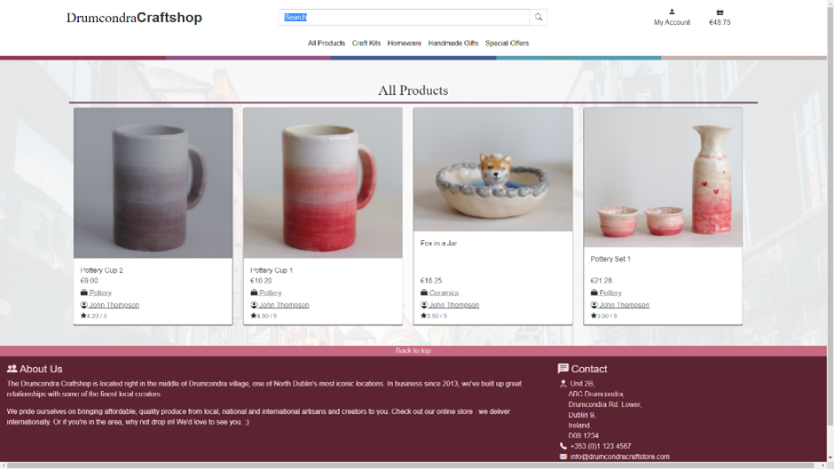
* Test-2.   As a **Shopper**, I want to be able to **view an individual product's detailed information** so that I can **see the detailed description, manufacturer or creator, price and rating.**.
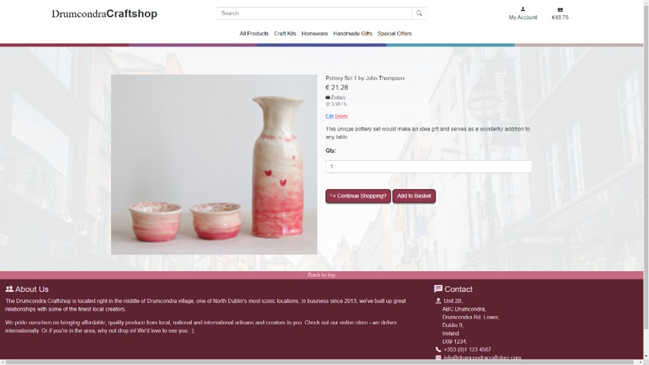
* Test-3.   As a **Shopper**, I want to be able to **see the number of items and value of my shopping basket** so that I can **be aware of how much I've committed to spend**.
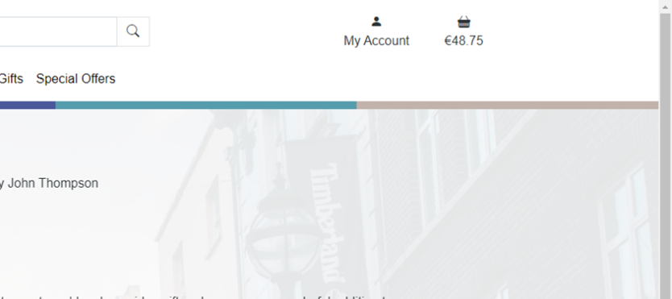

##### Registration and User Accounts

* Test-4.   As a **Site User**, I want to be able to **easily sign up for an account** so that I can **have an account and view my profile**.
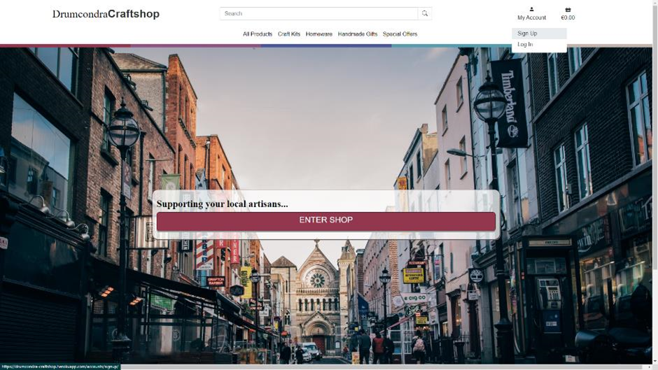
* Test-5.   As a **Site User**, I want to be able to **log in and logout** so that I can **access my personal information**.

* Test-6.   As a **Site User**, I want to be able to **recover my password** so that I can **regain access to my account if I forget my stored password**.

* Test-7.   As a **Site User**, I want to be able to **receive password change confirmation by email** so that I can **know my password has been changed - by me or someone else**.

* Test-8.   As a **Site User**, I want to be able to **have a personal email profile** so that I can **see order history, confirmations and personal information**.
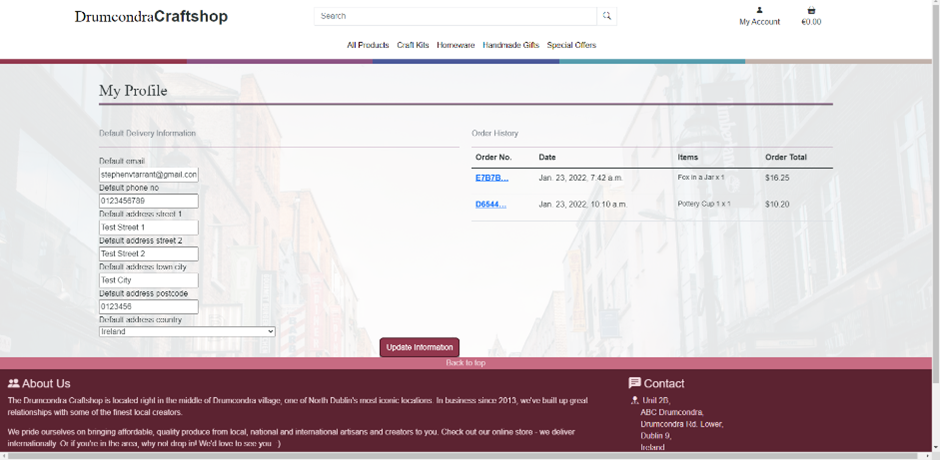

##### Sorting and Searching

* Test-9.   As a **Shopper**, I want to be able to **see a list of available products** so that I can **I can chose some to buy**.
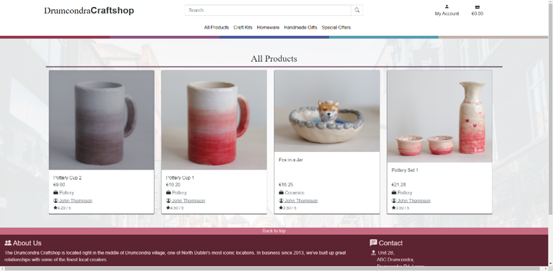
* Test-10.   As a **Shopper**, I want to be able to **chose a product category** so that I can **see a sub set of products of a particular type**.
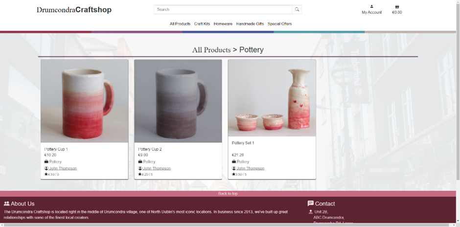
* Test-11.   As a **Shopper**, I want to be able to **sort by price or rating** so that I can **so that I can see items that are well reviewed or see ones in a particular price range**.

* Test-12.   As a **Shopper**, I want to be able to **search by product name** so that I can **find a particular item I'm looking for**.
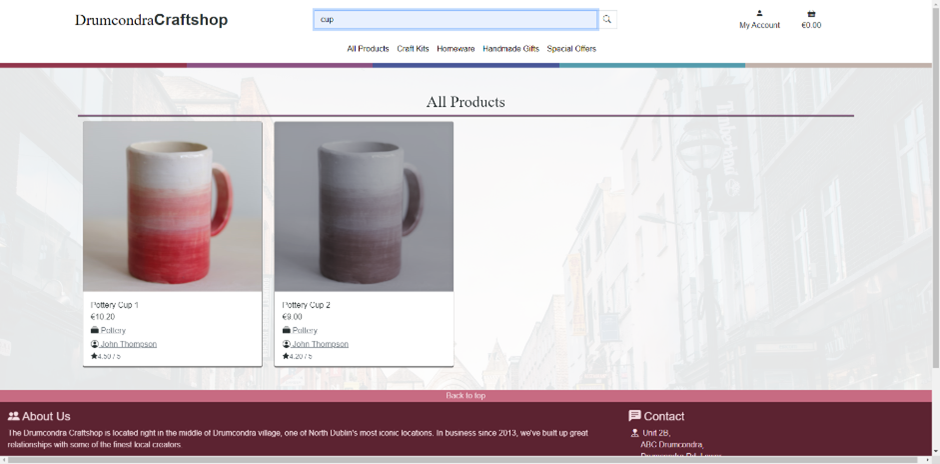
* Test-13.   As a **Shopper**, I want to be able to **see search results and number selected** so that I can **see what my search results are and know how narrow/wide my search criteria is**.

* Test-14.   As a **Shopper**, I want to be able to **see results for particular creator** so that I can **see other items made by the same person**.
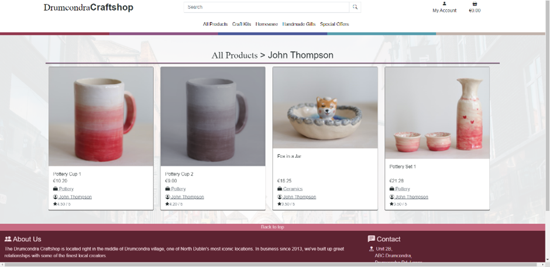

##### Purchasing and Checkout

* Test-15.   As a **Shopper**, I want to be able to **see a list of items in my shopping basket** so that I can **I know exactly what I am buying**.
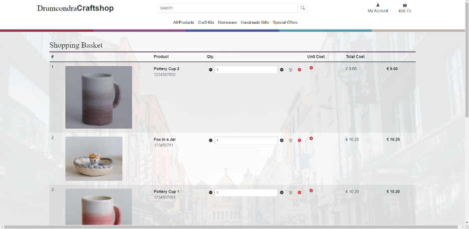
* Test-16.   As a **Shopper**, I want to be able to **adjust the quantity of items in my basket** so that I can **easily reduce or add extra items as needed**.
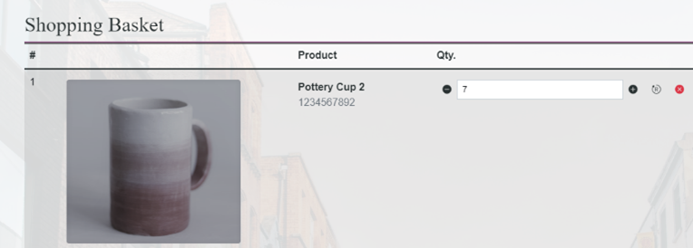
* Test-17.   As a **Shopper**, I want to be able to **return to the main shopping area from the shopping basket screen** so that I can **continue shopping after having confirmed what's in my basket**.
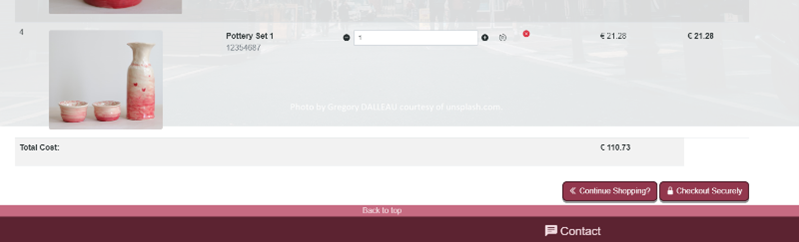
* Test-18.   As a **Shopper**, I want to be able to **buy items in my basket securely** so that I can **feel safe regarding my payment details**.


##### Site Administration

* Test-19.   As a **Site-Owner**, I want to be able to **create new products to sell in the shop** so that I can **easily expland my range of products**.

* Test-20.   As a **Site-Owner**, I want to be able to **create new creator/artisans for the store** so that I can **easily reduce or add extra items as needed**.

</details>

###### [Back to Top](#contents)

## Bugs <a name="bugs"></a>

---

Many bugs were encountered during the development of the project - all admittedly of my own making while trying to learn Django.

### Development Bugs

* BugFix:  Issue with AllAuth password authentication found. Error found in Settings.py AUTH_PASSWORD_VALIDATORS. Important note here is to ensure the correct version of Allauth is installed. (Currently 0.43.0.)
* Bugfix:  Used the variable product_id rather than product.id in the product detail anchor. This created some very strange error messages that took a long time to figure out what I had done wrong. The fix is described in the CI Boutique Ado tutorial.
* Bugfix:  Missing 'url' term from Django template link in base.html caused a synthax error. This took quite a while to figure out what I had done.
* BugFix:  Missing single quotes around search term in views.py caused a synthax error on implementation of the search bar. This is was obvious enough from the error message and quickly fixed.
* BugFix:  Error on variable name 'categories' in products/views.py. Incorrectly named 'category' and threw error message.
* BugFix:  Serious issues encountered trying to connect Heroku with AWS's S3 bucket. Many setting configurations were attempted. Solution was found to be an incorrectly assigned BASE_DIR in settings.py. Once this was corrected, static files were transferred to AWS and the deployed site loaded the correct css styles.


### Testing Bugs

* A few bugs were thrown up by the HTML Validator and CSS Validator. The solutions are given above in the **HTML Test** and **CSS Test** Sections.

###### [Back to Top](#contents)

## Deployment <a name="deployment"></a>

---

### Local Deployment <a name="local-deployment"></a>

The site has been deployed and tested locally on gitpod. testhigh

### Remote Deployment <a name="remote-deployment"></a>

The site has been deployed and tested remotely using Heroku and AWS S3 services. testhigh

###### [Back to Top](#contents)

## Credits <a name="credit"></a>

---

* Credit 1 testhigh

### Special Thanks

* My Code Institute mentor, [Simen Daehlin](https://github.com/Eventyret), for a lot of great advice and direction along the way. His time, effort and experience made a huge difference to the code quality, readability and end result. It would be hard to overstate his input here.

###### [Back to Top](#contents)